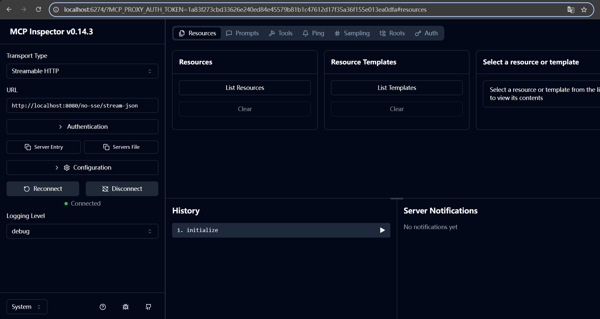
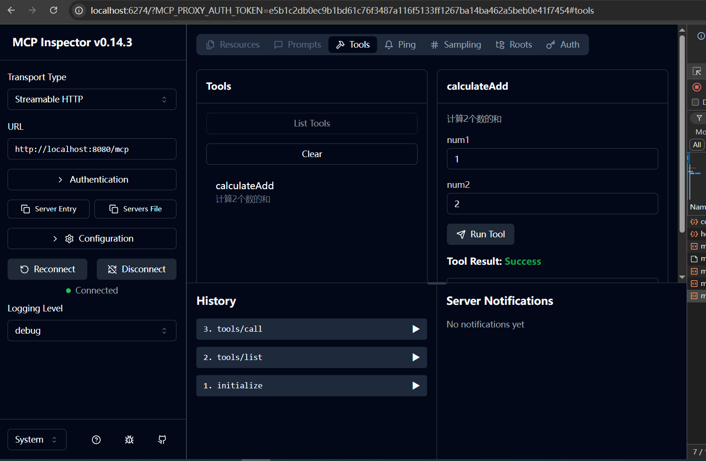
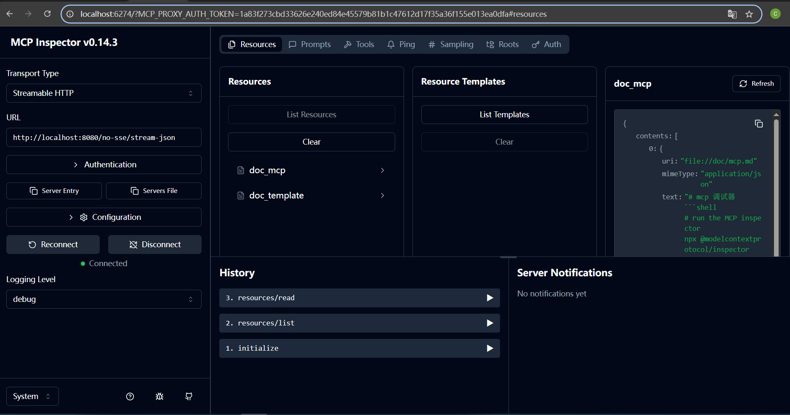
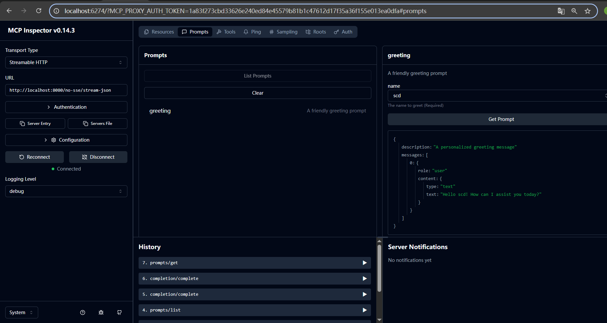

# streamable-mcp


# run
StreamableMcpApplication.java

# debug
run the MCP inspector
```shell
# run the MCP inspector
npx @modelcontextprotocol/inspector
```

config info
```text
http://localhost:8080/no-sse/stream-json
```

## connect


## tools


## resources


## prompts


# curl debug

The code has been refactored to eliminate session caching, making the session completely stateless. When making curl calls, no prior initialization is required, and there's no concept of execution order anymore.

Key technical implications:

1. Stateless architecture - each request is independent
2. No server-side session storage
3. Idempotent API design
4. No initialization prerequisites for API calls
5. Request sequencing is not enforced


This design pattern is commonly seen in RESTful APIs and serverless architectures where horizontal scalability is prioritized over state maintenance.

## initialize
```shell
curl 'http://localhost:8080/no-sse/stream-json' \
  -H 'accept: application/json, text/event-stream' \
  -H 'content-type: application/json' \
  --data-raw '{"method":"initialize","params":{"protocolVersion":"2025-03-26","capabilities":{"sampling":{},"roots":{"listChanged":true}},"clientInfo":{"name":"mcp-inspector","version":"0.14.3"}},"jsonrpc":"2.0","id":0}'
```
```json
{"jsonrpc":"2.0","id":0,"result":{"protocolVersion":"2024-11-05","capabilities":{"completions":{},"logging":{},"prompts":{"listChanged":true},"resources":{"subscribe":false,"listChanged":true},"tools":{"listChanged":true}},"serverInfo":{"name":"mcp-server","version":"1.0.0"}}}
```

## tools/list
```shell
curl 'http://localhost:8080/no-sse/stream-json' \
  -H 'accept: application/json, text/event-stream' \
  -H 'content-type: application/json' \
  --data-raw '{"method":"tools/list","params":{"_meta":{"progressToken":1}},"jsonrpc":"2.0","id":1}'
```
```json
{"jsonrpc":"2.0","id":1,"result":{"tools":[{"name":"calculateAdd","description":"计算2个数的和","inputSchema":{"type":"object","properties":{"num1":{"type":"integer","format":"int32","description":"数据1"},"num2":{"type":"integer","format":"int32","description":"数据2"}},"required":["num1","num2"],"additionalProperties":false}}]}}
```

## tools/call
```shell
curl 'http://localhost:8080/no-sse/stream-json' \
  -H 'accept: application/json, text/event-stream' \
  -H 'content-type: application/json' \
  --data-raw '{"method":"tools/call","params":{"name":"calculateAdd","arguments":{"num1":1,"num2":2},"_meta":{"progressToken":2}},"jsonrpc":"2.0","id":2}'
```

## prompts/list
```shell
curl 'http://localhost:8080/no-sse/stream-json' \
  -H 'accept: application/json, text/event-stream' \
  -H 'content-type: application/json' \
  --data-raw '{"method":"prompts/list","params":{"_meta":{"progressToken":3}},"jsonrpc":"2.0","id":3}'
```
```json
{"jsonrpc":"2.0","id":3,"result":{"prompts":[{"name":"greeting","description":"A friendly greeting prompt","arguments":[{"name":"name","description":"The name to greet","required":true}]}]}}
```

## completion/complete
```shell
curl 'http://localhost:8080/no-sse/stream-json' \
  -H 'accept: application/json, text/event-stream' \
  -H 'content-type: application/json' \
  --data-raw '{"method":"completion/complete","params":{"argument":{"name":"name","value":"scd"},"ref":{"type":"ref/prompt","name":"greeting"},"_meta":{"progressToken":5}},"jsonrpc":"2.0","id":5}'
```
```json
{"jsonrpc":"2.0","id":3,"result":{"prompts":[{"name":"greeting","description":"A friendly greeting prompt","arguments":[{"name":"name","description":"The name to greet","required":true}]}]}}
```

## prompts/get
```shell
curl 'http://localhost:8080/no-sse/stream-json' \
  -H 'accept: application/json, text/event-stream' \
  -H 'content-type: application/json' \
  --data-raw '{"method":"prompts/get","params":{"name":"greeting","arguments":{"name":"scd"},"_meta":{"progressToken":6}},"jsonrpc":"2.0","id":6}'
```
```json
{"jsonrpc":"2.0","id":6,"result":{"description":"A personalized greeting message","messages":[{"role":"user","content":{"type":"text","text":"Hello scd! How can I assist you today?"}}]}}
```